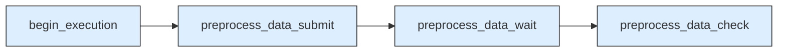
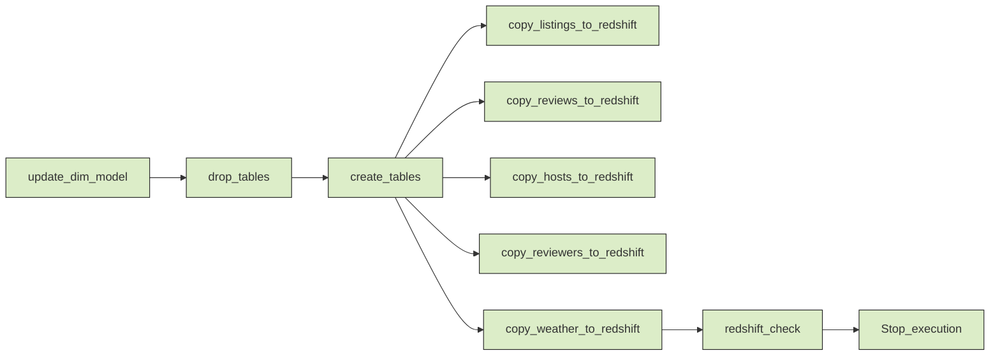

# Advanced Airbnb Data Engineering Platform with EMR, dbt, Kafka, and ML Forecasting

This repository presents a comprehensive data engineering platform designed to simulate a modern, production-grade Airbnb analytics infrastructure. It integrates real-time data ingestion, batch processing, data transformation, validation, and machine learning forecasting. The system is built on a foundation of cloud-native technologies and orchestrated through a robust workflow using Apache Airflow.

---

## Project Overview

This platform ingests, processes, models, and analyzes Airbnb listings and review datasets. It supports both historical batch data and simulated real-time streams, transforming and validating data before loading it into Amazon Redshift. An integrated machine learning model forecasts booking volumes, and the infrastructure is provisioned using Terraform. The architecture reflects modern enterprise data engineering systems that balance reliability, scalability, and observability.

---

## Architecture Diagram

The following diagram illustrates the overall system architecture:


### Component Breakdown

- **Data Sources**: Historical Airbnb data (CSV) and simulated streaming data.
- **Ingestion Layer**: Python scripts extract batch data; Kafka simulates real-time booking streams.
- **Processing Layer**: Spark jobs on AWS EMR clean, transform, and aggregate the data.
- **Storage Layer**: Amazon S3 is used for intermediate data storage, Redshift for the final data warehouse.
- **Transformation Layer**: dbt performs SQL-based data modeling in Redshift.
- **Validation Layer**: Great Expectations enforces data quality rules before and after transformations.
- **Machine Learning**: A Random Forest model forecasts booking volumes using enriched features.
- **Monitoring**: Future support for Grafana or CloudWatch to visualize pipeline health.
- **Orchestration**: Apache Airflow manages dependencies and task execution across the platform.
- **Infrastructure-as-Code**: Terraform provisions EMR clusters, S3 buckets, Redshift instances, and IAM roles.

---

## Airflow DAG Breakdown

The data engineering pipeline is divided into three DAG segments. Each stage is represented below using Mermaid diagrams.

### Phase I – Data Preprocessing



### Phase II – Spark Transformations and Enrichment

```mermaid
flowchart LR
    A[preprocess_data_check] --> B[process_listings_hosts_submit]
    B --> C[process_listings_hosts_wait]
    C --> D[listings_hosts_check]

    A --> E[process_weather_submit]
    E --> F[process_weather_wait]
    F --> G[weather_check]

    G --> H[process_reviews_submit]
    H --> I[process_reviews_wait]
    I --> J[reviews_check]
    J --> K[process_reviewers_submit]
    K --> L[process_reviewers_wait]
    L --> M[reviewers_check]
    M --> N[update_dim_model]

    classDef block fill:#e0f7fa,stroke:#222,stroke-width:1px
    class A,B,C,D,E,F,G,H,I,J,K,L,M,N block
```



### Phase III – Redshift Loading and Completion



---

## Technology Stack

| Category              | Tools and Technologies                             |
|-----------------------|----------------------------------------------------|
| Batch Processing      | Apache Spark on AWS EMR                            |
| Real-Time Ingestion   | Apache Kafka                                       |
| Data Transformation   | dbt (Data Build Tool)                              |
| Workflow Orchestration| Apache Airflow                                     |
| Storage               | Amazon S3, Amazon Redshift                         |
| Data Validation       | Great Expectations                                 |
| Machine Learning      | Python, pandas, scikit-learn                       |
| Infrastructure        | Terraform (AWS provisioning, IAM, networking)      |
| CI/CD                 | GitHub Actions                                     |
| Monitoring (Planned)  | Grafana / AWS CloudWatch                           |

---

## Setup Instructions

1. Clone the repository:
```bash
git clone https://github.com/yourusername/airbnb-data-platform.git
cd airbnb-data-platform
```

2. Configure your environment:
   - Set AWS credentials and Redshift access.
   - Update `profiles.yml` for dbt configuration.

3. Provision infrastructure:
```bash
cd terraform
terraform init
terraform apply
```

4. Simulate streaming data (Kafka):
```bash
cd kafka
pip install -r requirements.txt
python producer.py
```

5. Run Spark jobs manually or via Airflow on EMR.

6. Execute dbt models:
```bash
cd dbt
dbt run
dbt test
```

7. Validate data with Great Expectations:
```bash
great_expectations checkpoint run airbnb_suite
```

8. Train and evaluate forecasting model:
```bash
cd ml_forecasting
pip install -r requirements.txt
python train_forecast_model.py
```

---

## Machine Learning Forecasting

This platform includes a forecasting module built with `scikit-learn`. A `RandomForestRegressor` model is trained using historical listing data enriched with neighborhood, pricing, and temporal features. The model predicts future booking volumes on a monthly basis.

This ML component can be extended with:
- More features (e.g., sentiment from reviews, weather patterns)
- REST API deployment via FastAPI
- Model monitoring with EvidentlyAI or SageMaker Model Monitor

---

## CI/CD Pipeline

Every push to the `main` branch triggers the following:
- Linting and dependency installation
- `dbt compile`, `dbt test`
- Great Expectations validation
- Artifact generation for dbt docs (optional)

GitHub Actions handles the automated CI process.

---

## Future Roadmap

- Add Grafana dashboards for observability
- Deploy ML model with inference API and CI pipeline
- Integrate DataHub or Amundsen for metadata discovery
- Introduce incremental models in dbt
- Auto-refresh Redshift materializations

---

## License

This project is open-sourced under the MIT License.